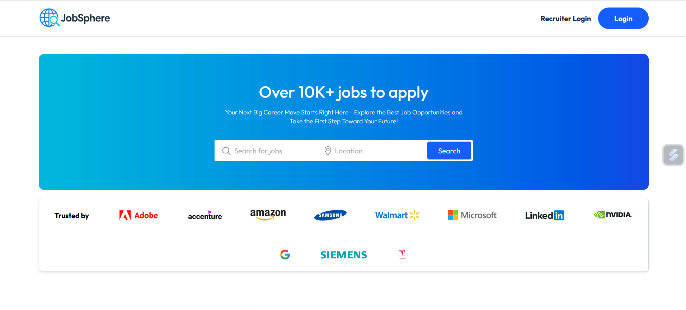

# 💼 JobSphere – MERN Stack Job Portal 🚀

Connect talent with opportunity — a complete job portal web app for **job seekers** and **recruiters**.

## 🔍 Features

### 👤 For Job Seekers
- Search and filter job listings by location & category
- Apply online with one click
- Upload resumes to your profile 📄
- Secure authentication via [Clerk](https://clerk.com) 🔐

### 🧑‍💼 For Recruiters
- Post new job opportunities 📝
- Manage listings and applications
- View applicant resumes
- Accept or reject candidates with ease ✅❌

## 🛠️ Tech Stack

- **MongoDB** – NoSQL database 🗃️  
- **Express.js** – Backend framework 🛣️  
- **React.js** – Interactive frontend ⚛️  
- **Node.js** – Server-side runtime 🚀  
- **Clerk** – Authentication & user management 🧾  
- **Sentry** – Error tracking & performance monitoring 🛡️  
- **Vercel** – Deployment platform for frontend & backend ☁️  

## 🌐 Live Demo

🔗 [Visit JobSphere](https://job-portal-new-client-plum.vercel.app/)

## 📸 Preview

<!-- You can add screenshots here later like:

-->

## 📁 Folder Structure
📦 Job_Portal/
├── 📁 client/                # Frontend (React + Vite)
│   ├── 📁 public/
│   ├── 📁 src/
│   │   ├── 📁 assets/
│   │   ├── 📁 components/
│   │   ├── 📁 context/
│   │   ├── 📁 pages/
│   │   └── App.jsx
│   └── package.json
├── 📁 server/                # Backend (Express + Node)
│   ├── 📁 controllers/
│   ├── 📁 middlewares/
│   ├── 📁 models/
│   ├── 📁 routes/
│   └── server.js
├── 📄 vercel.json
├── 📄 README.md
└── 📄 .gitignore


## 🚀 Getting Started

1. Clone the repo:
   ```bash
   git clone https://github.com/Haribabu-g/Job_Portal.git
   ```

2. Navigate into frontend or backend, install deps:
   ```bash
   cd client && npm install
   cd ../server && npm install
   ```

3. Setup .env with necessary credentials (Clerk, Sentry, DB_URI)
4.Run locally with:
    ```bash
    npm run dev
    ```


Made with ❤️ by @Haribabu-g


